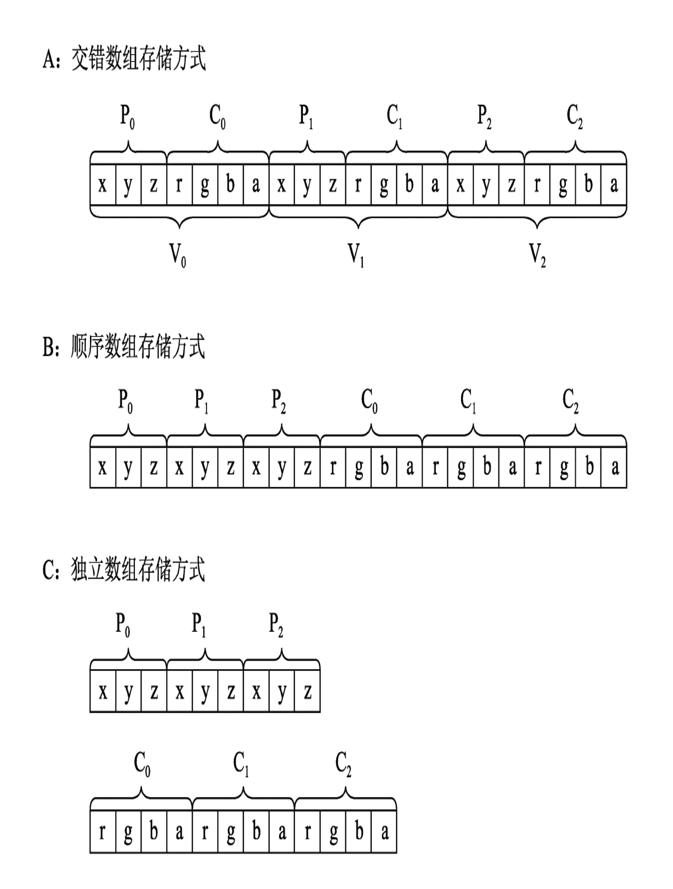

#

;

WebGL最关键的一个功能是将3D顶点(Vertex)表 示的几何图形光栅化(Rasterization)成片段 (Fragment)，每个片段都具有与像素对应的坐标 值、颜色值、深度值、模板值等属性。接下来这些片 段要经历一系列片段测试和操作，如果测试成功，才 能将片段中的各种数据写入对应的帧缓冲区。例如片 段的颜色值就写入到颜色缓冲区去，深度值就写入深 度缓冲区(如果存在深度缓冲区)，而模板值就写入 模板缓冲区(如果存在模板缓冲区)。

WebGLContextAttributes中preserveDrawingBuffer对 帧缓冲区的影响

WebGLRenderingContext类提供了3个方法来查询 或设置一些布尔类型的渲染状态

enable(cap: GLenum): void; // 开启某个渲染状态
isEnabled(cap: GLenum): GLboolean; // 查询某个渲染状态是否开启
disable(cap: GLenum): void; // 关闭某个渲染状态

当WebGLRenderingContext上下文渲染对象丢失时，会触发WebGLContextEvent事件。可以直接在 canvas元素中监听该事件。

视矩阵、投影矩阵、裁剪和视口
WebGL的核心是将一个三维顶点表示的场景或物体 光栅化成二维像素图像，然后显示在输出设备上，例 如屏幕等。在整个过程中，需要将整个场景或物体从 三维坐标系变换成屏幕坐标系的表示，要完成这个过 程，需要经历3个步骤:
(1)坐标系变换:将局部坐标系表示的点变换到 世界坐标系中，然后再变换到视图坐标系，接着继续 变换到投影坐标系(又叫裁剪坐标系)。一般情况 下，在绘制场景或物体时需要组合多种变换。我们可 以使用矩阵来变换各种坐标系。
(2)裁剪操作:由于最后总是显示在例如canvas 元素指定的矩形区块中，因此位于该矩形区块之外的 物体都会被裁剪掉，在WebGL中可以用scissor方法设 置裁剪区域。
(3)视口变换:经过变换后的坐标和canvas元素 指定的矩形区块中的像素必须要建立对应关系，这个 过程被称为视口变换。在WebGL中可以用viewport方法 设置视口区域。

`this.gl.enable(this.gl.SCISSOR_TEST);`
如果不主动开启SCISSOR_TEST， WebGL默认会根据Canvas的尺寸进行裁剪操作。

GLSL(OpenGL Shading Language)

attribute变量只能用于Vertex Shader中。

Vertex Shader中内置两个预先保留的特殊 变量: `gl_Position` 和 `gl_PointSize`。

Fragment Shader中能够使用varying和uniform变量，并且Fragment Shader中内置了两个特殊的变量: `gl_FragColor` 和 `gl_FragData`。

int, ivec2, ivec3, ivec4;

`getShaderParameter`;
`getShaderInfoLog(shader: WebGLShader): string | null`;

全局宏：
`#ifdef ... #endif`;

```js
let attributesCount: number = gl.getProgramParameter(program, gl.ACTIVE_ATTRIBUTES);
let uniformsCount: number = gl.getProgramParameter(program, gl.ACTIVE_UNIFORMS);

gl.getActiveAttrib(program, index: number): WebGLActiveInfo | null;

interface WebGLActiveInfo {
    name: string;
    size: number;
    type: number;
}

```

调用 WebGLRenderingContext 对象的 bindBuffer 方法**激活缓冲区**，该方法的原型如下: `bindBuffer(target: GLenum, buffer: WebGLBuffer | null): void;`

`gl.ARRAY_BUFFER` 表示顶点属性数据集合，而 `gl.ELEMENT_ARRAY_BUFFER` 表示索引数据集合。

对于 bindBuffer 方法来说，具有两个作用:
·当绑定到以前创建过的 WebGLBuffer 对象时，这个 WebGLBuffer 对象就称为**当前活动的缓冲区对象**。
·当绑定到 null 时，WebGL就会将当前活动缓冲区对象指向 null 值，表示**停止使用缓冲区对象**。

由此可见，WebGL 就是一个渲染状态机，其内部持有一个当前正在操作的 WebGLBuffer 指针。如果你的 WebGL 应用有多个WebGLBuffer 对象，则需要多次调用 bindBuffer 方法。你需要告诉 WebGL 状态机，我要多个当中的哪个 WebGLBuffer 作为当前活动对象。以后所有的 WebGLBuffer 相关操作都是针对当前活动的那个 WebGLBuffer 对象而言的。

`deleteBuffer(buffer: WebGLBuffer | null): void;`

;

WebGL属于右手坐标系，顶点的声明顺序必须是符合右手定则，因此每个三角形都是以逆时针方向定义顶点数据的。

如何将 WebGLBuffer 中的顶点属性数据和 GPU 中的 Vertex Shader 的 attribute 变量相关联。

当使用 `enableVertexAttribArray` 方法开启对应的顶点属性，并且调用 draw 开头的方法 (gl.drawArrays 和gl.drawElements)后，WebGL驱动会自动将 WebGLBuffer 中的数据上传到 Vertex Shader 中，进行顶点和片段着色计算，最终显示到目标设备上。

```js
// 调用 drawArrays 对象
this.gl.drawArrays( this.gl.TRIANGLES, 0, 6 );
// 在调用 draw 方法后，要将渲染状态恢复到未设置之前
this.gl.useProgram( null );
this.gl.disableVertexAttribArray(this.attribMap[ "aPosition" ].location);
this.gl.disableVertexAttribArray( this.attribMap[ "aColor" ].location );
this.gl.bindBuffer( this.gl.ARRAY_BUFFER, null );
```
